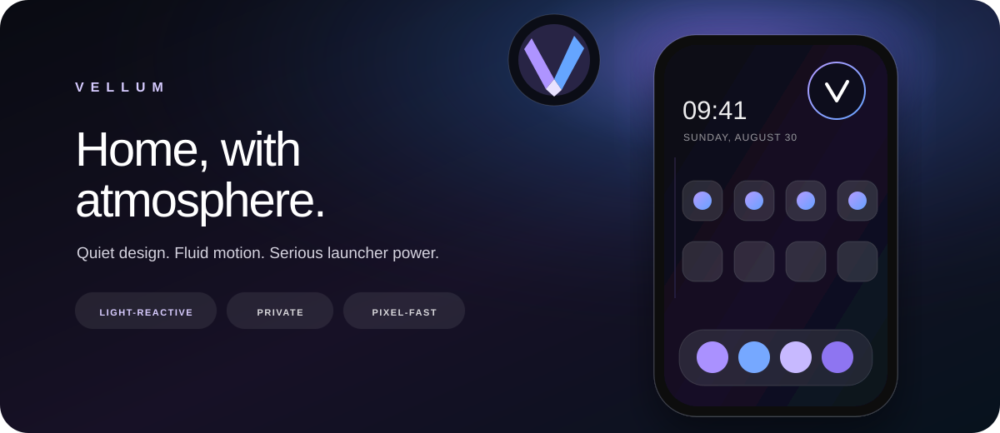

<p align="center">
  
</p>

# Vellum Launcher

**Home, with atmosphere.** Vellum is a fast, open-source Android launcher that pairs the power and compatibility of Lawnchair with a calmer, more tactile visual language.

[](https://github.com/soham-bhattacharya/Vellum-Launcher/actions/workflows/ci.yml)
[](LICENSE.txt)
[](#install)

> [!IMPORTANT]
> **Bloom Preview 1** is an enthusiast preview built from Lawnchair's Android 16 development branch. Back up an existing launcher layout before making Vellum your default home app.

## The Vellum experience

- **Context Surfaces** — Vellum's headline idea. The home screen has a *surface* for each stretch of the day — Morning, Day, Evening, Night — each with its own atmosphere and its own short list of apps. Surfaces are strictly **additive**: they retint the ambient layer and fill the surface panel, and they never rearrange your grid. Your icons do not move, ever. Long-press any app to pin it to the surface that is active right now, bind a gesture (or tap the Halo) to open the panel, and tap a chip to pin a different surface until the next boundary. Every surface is editable under *Home screen → Vellum → Surfaces*: name, start and end time, colour, ambient strength, and its app list.
- **Looks** — seven complete, ready-to-wear setups in a gallery under *Home screen → Vellum → Looks*: **Bloom**, **Aurora**, **Dunes**, **Nocturne**, **Paper**, **Signal**, and **Index**. A look is a whole setup rather than a palette: as well as colours and background design it can change the shape of the drawer and adopt an icon pack you already have. One tap sets the colours, background design, and atmosphere for every part of the day; a second option also fills each surface with apps chosen for that time of day. Every card in the gallery renders the *real* backdrop rather than a bundled screenshot, so what you see is exactly what you get. Applying a look never moves a home screen icon, and it keeps any surface you have renamed or switched off.
- **Background designs** — seven distinct backdrops, choosable per surface: **Bloom** (a single warm source with orbits and motes), **Aurora** (ribbons of light), **Dunes** (layered horizons), **Mesh** (overlapping colour fields), **Nocturne** (near darkness and stars), **Grain** (flat pigment on textured stock), and **Veil** (almost nothing). They are genuinely different compositions, not one gradient in seven hues — the gallery deliberately includes a light one, a textured one and a restrained one.
- **Drifting light** — a surface does not hold one flat colour and then cut to the next. It keeps its own light for most of its window, then eases toward whatever follows over the last stretch, so the boundary arrives with the colours already matched and only the background design left to change. Half past five in the morning and half past ten are both Morning, and they do not look the same.
- **Ambient Canvas** — the layer all of the above is drawn into: page-linked parallax behind the workspace, which paging moves without repainting. Adjustable from 0–100%, and switchable off.
- **Column drawer** — the one-handed idea Niagara popularised: the app drawer as a single alphabetical column, names beside icons, with the A–Z rail under your thumb. Off by default, and applied wholesale by the **Index** look. Preview quality: row spacing is not tuned down yet, so the list is sparser than it should be.
- **Curated icon packs** — Vellum bundles none (they are separately licensed and individually larger than the launcher), but *Home screen → Vellum → Icon packs* recommends a short list worth having, applies any you already have in one tap, and links out for the rest.
- **The Halo** — an optional shortcut in the top-right corner: tap for All Apps, hold for settings. It is an overlay above the workspace, so it covers one home screen cell; for that reason it ships **off** and is opt-in under *Home screen → Vellum*.
- **Bloom Reveal** — a cinematic, one-time welcome that introduces the launcher without adding another setup maze.
- **Folded identity** — a new adaptive and monochrome icon inspired by a sheet folding into a `V`.
- **Pixel-fast foundation** — Launcher3 recents, global search, icon packs, gestures, folders, Smartspace, backup/restore, and Lawnchair's deep customization remain available.
- **Motion with manners** — Vellum's decorations are driven by the launcher's own state transition, so they track All Apps and Overview exactly, including a half-finished swipe that the user reverses. They observe Android's system animation setting, and follow the live Material You accent without needing a restart.

The ambient layer has no network access, telemetry, service, or background timer. Vellum inherits Lawnchair's optional online search and update-related components; network search runs only through features the user chooses to use.

## Install

1. Download the newest APK from [Releases](https://github.com/soham-bhattacharya/Vellum-Launcher/releases).
2. Allow installation from your browser or file manager when Android asks.
3. Open **Vellum**, tap **Enter Vellum**, then choose it as the default Home app.

Looks describe their apps by *role* — phone, messages, calendar, mail, browser, music — and resolve them on the device they land on, preferring the system's own default dialer and SMS app and then the standard `CATEGORY_APP_*` intents. Nothing ships a hard-coded package name as a slot, so a preset arrives filled on a Pixel, a Galaxy, or a de-Googled ROM rather than half empty. A role the device cannot fill is skipped rather than becoming a dead icon.

The GitHub build uses the independent package `app.vellum.launcher`, so it can coexist with official Lawnchair. Preview/debug builds use `app.vellum.launcher.debug`.

## Build it yourself

Prerequisites: JDK 21, the Android SDK, and Git with submodule support.

```bash
git clone --recurse-submodules https://github.com/soham-bhattacharya/Vellum-Launcher.git
cd Vellum-Launcher
./gradlew assembleLawnWithQuickstepGithubDebug
```

The APK is written to `build/outputs/apk/lawnWithQuickstepGithub/debug/`.

For an optimized build:

```bash
./gradlew assembleLawnWithQuickstepGithubRelease
```

Without `keystore.properties`, release builds fall back to the local Android debug key and are suitable for personal testing—not store distribution.

## Design and performance notes

Vellum's home effects are native Android `Canvas` drawing rather than a WebView, bitmap animation, or live wallpaper.

Surfaces tile the day: each one's end is the next one's start, and moving either side of a boundary moves both, so there is never a minute that no surface covers or that two surfaces claim. That arithmetic, including the midnight wrap, is covered by JVM unit tests in `tests/vellum/app/lawnchair/vellum/surface/` (run `./gradlew testLawnWithQuickstepGithubDebugUnitTest`).

Context surfaces do no polling, and the drifting light does not change that. The engine computes exactly when the light next has to change — the moment the active surface begins leaning toward its successor, or the moment it ends — and schedules a single callback for that. A surface that lasts six hours therefore costs two wake-ups for its whole window, not one per minute of drift. Between those, the value is recomputed when the launcher resumes, which is the only time anybody can see it: the light is correct every time you look at it rather than continuously recalculated while you are not. A change of surface repaints the ambient layer exactly once, at the bottom of a short dip; the small steps of the drift are committed silently, because a two-thirds-of-a-second dip for a change nobody could see would turn the drift into a flicker.

The home screen swipe is the most performance-sensitive gesture a launcher has, so the ambient layer is built never to repaint during one. It is split into two children: a wash that never moves, and a field carrying the subject of whichever background design is active. Paging assigns only `translationX`/`translationY` to the field — no `invalidate()` — so the GPU composites the existing content instead of re-rasterising a full-screen gradient every frame. The field is promoted to a hardware layer for the duration of a scroll and released about 200 ms after the workspace settles, so a swipe costs a texture blit per frame while at rest the effect costs nothing and holds no layer memory. Shaders and paths are built on size, theme, and design changes only, never inside `onDraw`; every backdrop is required to be frame-independent, so two draws with the same size and palette produce the same image and nothing in the catalogue can introduce a per-frame cost.

Visibility is a `StateHandler` writing into the launcher's own transition animation, not a parallel timer, so the decorations stay in lockstep with All Apps and Overview.

Both effects are user preferences. The ambient layer paints over the wallpaper and the Halo covers a home screen cell, so neither is imposed: the ambient canvas has an intensity slider and an off switch, and the Halo is off until you turn it on.

The one-time welcome animation honors `ValueAnimator.areAnimatorsEnabled()`, cancels on detach, and permanently removes itself from the view hierarchy after dismissal.

## Lineage

Vellum is a fork of [Lawnchair 16](https://github.com/LawnchairLauncher/lawnchair), which is based on Android's Launcher3. The first Vellum release began at upstream commit [`d1fa12d`](https://github.com/LawnchairLauncher/lawnchair/commit/d1fa12df1951b92c1c0e9c06b4a0815d683b5260).

Strings that carry the product name were rebranded in the base `values/strings.xml`. Their existing Lawnchair-era translations were removed rather than left in place, so those specific strings currently fall back to English in other locales until Vellum has its own translation pipeline (` Crowdin ` is not yet configured for `app.vellum.launcher`). Everything else remains fully translated. The full Vellum-owned catalogue is `vellum_*` in `lawnchair/res/values/strings.xml:27` — contributions for those keys are welcome in English for now.

> **Backup note:** context surfaces and other Vellum preferences live in DataStore (`datastore/preferences.preferences_pb`) and are now included in `res/xml/backupscheme.xml:20` for system full-backup. Lawnchair's own export under *Home settings → Backup* is not yet wired for surfaces; a factory reset without system backup will reset surfaces to defaults.

The Lawnchair project and its contributors created and maintain the substantial launcher foundation beneath Vellum. Please support the [Lawnchair project](https://opencollective.com/lawnchair) and review its [documentation](https://docs.lawnchair.app/) for advanced launcher features.

## License

Vellum, Lawnchair, and Launcher3 code in this repository are distributed under the [Apache License 2.0](LICENSE.txt), with copyright notices retained in their respective source files.
